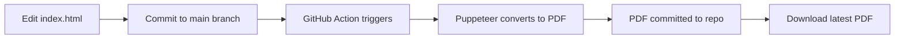

# 🎯 Sasi Sajja - Interactive Resume with Auto PDF Generation

<p align="center">
  
  
  
</p>

## ✨ Features

- 📄 **Single HTML Source** - Edit once in `index.html`
- 🤖 **Automatic PDF Generation** - GitHub Actions generates PDF on every commit
- 🎨 **Print-Optimized** - Professional layout designed for both web and PDF
- ⚡ **Instant Updates** - Commit → PDF generated → Available for download
- 🔄 **Version Control** - Track all resume changes with Git

## 🚀 How It Works



### The Magic Behind the Scenes

1. **You edit** `index.html` with your resume updates
2. **You commit** to the `main` branch
3. **GitHub Actions** automatically runs the workflow
4. **Puppeteer** (headless Chrome) renders HTML to PDF
5. **PDF is saved** back to the repository as `Sajja_Sasi_Resume.pdf`
6. **Download** your PDF anytime from the repository!

## 📥 Quick Download

**Latest PDF Resume:** [Download Sajja_Sasi_Resume.pdf](./Sajja_Sasi_Resume.pdf)

## 🎓 How to Update Your Resume

### Method 1: GitHub Web Interface (Easy)

1. Go to https://github.com/sasisathya/resume
2. Click on `index.html`
3. Click the pencil icon (✏️) to edit
4. Make your changes
5. Click "Commit changes" at the bottom
6. Wait ~2 minutes for the PDF to auto-generate
7. Refresh the page and download the new PDF!

### Method 2: Local Editing (Advanced)

```bash
# Clone the repository
git clone https://github.com/sasisathya/resume.git
cd resume

# Edit the HTML file
code index.html  # or use any editor

# Commit your changes
git add index.html
git commit -m "Update work experience"
git push

# PDF will be auto-generated by GitHub Actions!
```

## 📁 Repository Structure

```
resume/
├── index.html                    # Your resume (EDIT THIS FILE)
├── Sajja_Sasi_Resume.pdf        # Auto-generated PDF (DO NOT EDIT)
├── .github/
│   └── workflows/
│       └── generate-pdf.yml      # GitHub Action workflow
└── README.md                     # This file
```

## 🎨 Customization Guide

### Updating Content

Edit `index.html` and modify:

- **Header:** Name, contact info, links
- **Professional Summary:** Your elevator pitch
- **Technical Skills:** Languages, frameworks, tools
- **Experience:** Jobs, responsibilities, achievements
- **Education:** Degrees and certifications
- **Awards:** Recognition and accomplishments

### Styling Tips

The resume uses:
- **Font:** Calibri (professional, ATS-friendly)
- **Size:** 11pt body, 20pt name
- **Colors:** Black text on white (print-optimized)
- **Layout:** Standard letter size (8.5" x 11")

## 🔧 GitHub Actions Workflow

The workflow (`.github/workflows/generate-pdf.yml`) runs when:

- ✅ You push changes to `index.html` on `main` branch
- ✅ You manually trigger it from Actions tab
- ❌ Does NOT run when you update the PDF directly (prevents loops)

**Workflow Steps:**
1. Checkout repository
2. Setup Node.js
3. Install Puppeteer
4. Convert HTML to PDF
5. Commit PDF back to repository

**Note:** The commit message includes `[skip ci]` to prevent infinite loops.

## 📊 Workflow Status

Check if your PDF is generating:

1. Go to the **Actions** tab in GitHub
2. Look for "Generate PDF Resume" workflow
3. See real-time progress and logs

## 🎯 Use Cases

- **Job Applications:** Always have an up-to-date PDF ready
- **Quick Updates:** Change job, add skills, update contact info instantly
- **Version History:** Track all changes with Git commits
- **Multiple Versions:** Create branches for different job applications

## 💡 Pro Tips

1. **Preview Before Committing:** Open `index.html` in your browser to see changes
2. **Test Locally:** Print to PDF from browser to verify formatting
3. **Keep It Simple:** Avoid complex CSS that might not render well in PDF
4. **ATS-Friendly:** Use standard fonts and clear section headings
5. **Mobile-Friendly:** The HTML works on all devices!

## 🛠️ Manual PDF Generation (Local)

If you want to generate PDF locally:

```bash
# Install Puppeteer globally
npm install -g puppeteer

# Run the generation script
node -e "
const puppeteer = require('puppeteer');
const fs = require('fs');

(async () => {
  const browser = await puppeteer.launch();
  const page = await browser.newPage();
  const html = fs.readFileSync('index.html', 'utf8');
  await page.setContent(html, { waitUntil: 'networkidle0' });
  await page.pdf({
    path: 'Sajja_Sasi_Resume.pdf',
    format: 'Letter',
    printBackground: true
  });
  await browser.close();
  console.log('PDF generated!');
})();
"
```

## 📝 License

This resume template is open source and free to use.

## 👨‍💻 Author

**Sasi Sajja**
- 📧 Email: sasisathya.sajja@gmail.com
- 💼 LinkedIn: [linkedin.com/in/sasi-sajja](https://linkedin.com/in/sasi-sajja)
- 🌐 Portfolio: [sasi-inspired-folio.lovable.app](https://sasi-inspired-folio.lovable.app)
- 💻 GitHub: [@sasisathya](https://github.com/sasisathya)

---

<p align="center">
  <strong>🚀 Edit once, PDF automatically! No manual conversions needed.</strong>
</p>

<p align="center">
  Made with ❤️ and ⚡ GitHub Actions
</p>
